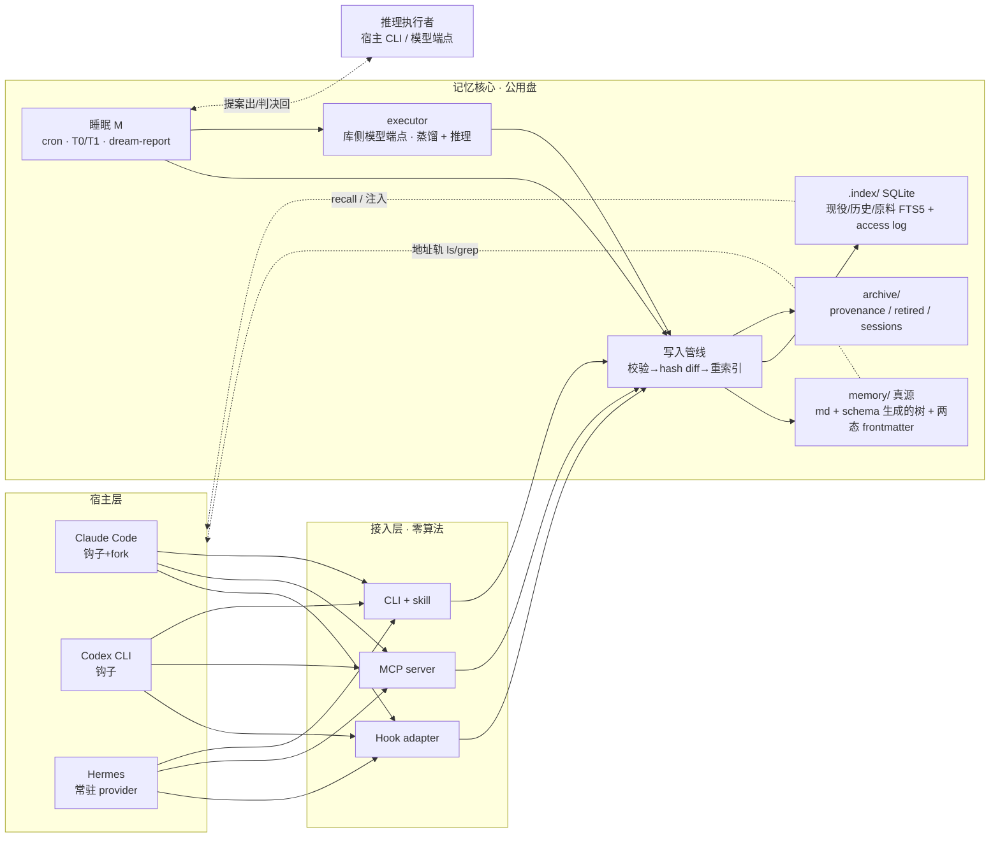

# 系统总览

1. **Metadata** — 作者:Claude;评审:Ryan;2026-09-01;状态 **accepted**

## 组件图

## 要点

- **三个物理组件**:`memory/` 真源、`.index/` 投影(可整删重建)、`archive/` 原料(append-only)。
- **一条写路径**:执行器写与 M 改全部过同一条管线(Invariant 2);写入是对账后的批量填表,路径由类型 schema 算出。
- **智能在 executor**:宿主只捕获、触发、注入、召回;蒸馏与 M 的推理由库侧模型端点完成(ADR-002 修订)。
- **智能在外**:核心不含模型客户端;需要判断力处向执行者借,执行者是宿主 CLI 或模型端点,
  两者可互换、都不含算法(Invariant 5、ADR-002)。
- **三条读轨**:SessionStart 注入(确定性)、recall 检索(BM25 核心 + 向量插件)、
  目录树地址可达(兜底)。
- **部署两形态**:本地单可执行物(默认);Docker(容器装 CLI + MCP server,`-v` 挂记忆盘,
  真源仍是卷上的文件)。
- **实验系统**围绕核心而建:回放驱动器把 benchmark 会话灌进三宿主,考试阶段重开隔离会话,
  详见 domains/experiment-harness.md。
