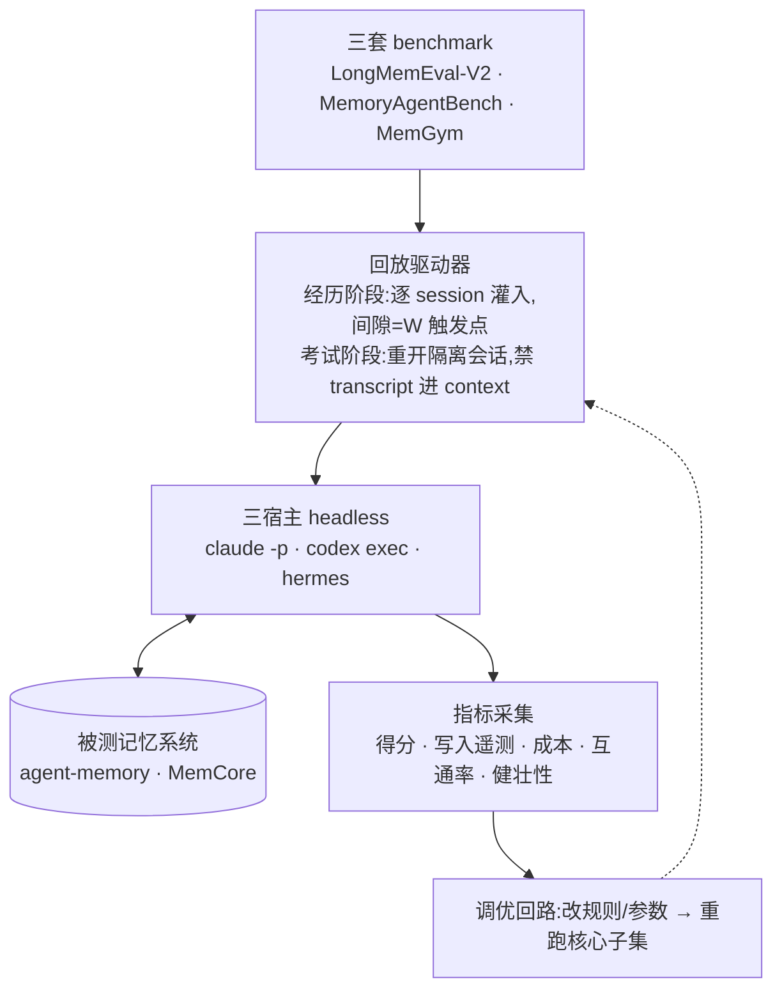

# 域:Experiment Harness(实验系统)

1. **Metadata** — 作者:Claude;评审:Ryan;2026-09-01;状态 **accepted**
2. **Context and Scope** — 三宿主 × 三套主流 benchmark × W 选项对比;
   同时验证通用性(三档宿主能力)与共库互通。
3. **Goals / Non-Goals** — 目标:R 固定下用主流 benchmark 裁决 W 选项;
   记忆规则(skill 措辞/参数)是被优化的变量。不做:自建 benchmark;MCP 不进实验矩阵
   (接入手段非写入策略,P1 一致性测试覆盖)。

## 4. The Actual Design



**归因逻辑**:R 全程固定,同套件 E2E 得分差只能来自 W。W0 空白对照给记忆净贡献底线。

**M 作为第二维度**:一次 run 记录它重放的库睡过什么觉,报表按「写入选项 × 睡眠」分行。
问 M 值多少钱的实验因此不必重跑写入:同一批库拷贝多份,各睡各的,再考同一张卷——起点逐字节
相同,R 相同,分差只能来自睡眠。睡眠步骤本身接受推理者与配置旋钮(含 authority),因为
「无人值守能不能合并」正是要被测的东西,而不是要被绕过的东西。

**协议要点**:考试会话只带记忆系统(注入+recall),严禁原始 transcript——隔离是
有效性条件;**宿主自带记忆必须关停**(否则两套记忆并存,得分不可归因);
W3 异步需保证蒸馏完成或将时滞计入;MemGym 逐 episode 交替(写与读滚动,无一次性考试)。

**宿主 × W 可用性**:实测三宿主(Claude Code / Codex / Hermes)均可跑 W0 与 W2——
蒸馏由 harness 以子进程发起,「边界 fork」对宿主的要求仅是可被启动,原先预估的可用性差异
在这一层不成立(evidence: experiments/results/p1-generality.md)。
**宿主自带记忆必须逐个关停并事后核验为空**,否则宿主写进自己的库、回报成功,测的是空气。

**记忆系统维度**:被测记忆系统与宿主同为方言,矩阵是 系统 × 宿主 × W。一个系统对象
承担:建库、交给宿主的环境与工具白名单、两阶段的系统提示、写入命令提示与写前纪律、
会话起始注入、记录计数与全文、指纹、释放。任务措辞(边界框架、蒸馏任务、考题外壳)
由 harness 持有、跨系统共享;写前纪律与检索指令属于系统本身——MemCore 用它自己的
skill,与它的钩子注入一致。系统对系统的行是端到端结论:两臂指纹不同,守卫拒绝归因,
这正是它该做的。唯一可分离的量是**写入覆盖率**——离线探针按(系统, W)报出答案落盘率,
词法覆盖、弃权题除外、一轮即定。固定考试只对本系统可用:harness 只有本系统的上下文构建器。

**规矩不在这里**:什么算一个结果、归因需要什么条件、run 必须留下什么,见
[实验规范](../../experiments.md)。下面的三期是原计划;实际轮次编号以
`experiments/results/` 为准。

**三期执行**:
- P1 通用性冒烟:3 宿主 × W1(Hermes 用 W4)× 1 小套件 + 互通(A 写 B 读、
  同请求异入口一致性含 MCP)——失败则接入层返工
- P2 写入对决:Claude Code × W0–W4 × LongMemEval-V2 + MemoryAgentBench 子集
  → 产出写入默认档;同步采成本(token 区分 cache/全价、latency、阻塞时长)
- P3 全量+调优:获胜选项 × 3 宿主 × 全三套件(MemGym 长程);规则迭代,
  每轮改动重跑 P2 核心子集防回归

5. **Alternatives Considered** — 自建种针/staleness 套件(否:R 固定即可归因,
   主流套件即够;写入率等作为随跑遥测保留)。
6. **Cross-cutting** — benchmark 数据含合成对话,不混入真实用户记忆盘;
   每次 run 独立盘,互通测试用专用盘。
7. **Risks** — Hermes provider 接口/日志格式待核验;MemGym 任务形态与驱动器适配为
   P1 前置调研;benchmark 判分依赖 LLM judge 时的 judge 模型成本与偏差。

## 8. Progressive raw-trace Read ablation (proposed)

This is a read-side replay over fixed stores; experience/Write is skipped. Use one stratified
12–24-question development panel to reject weak designs, then—only after a stable directional
signal—the full benchmark with the repeated-replay and paired-test requirements in
`docs/experiments.md`.

| Arm | Exact definition |
|---|---|
| R0 | Current-main normal memory-only Context behavior (`deep=false`) on the frozen stores |
| R1 | The same normal memory recall and disclosure, then an explicit `deep` call using the existing global raw FTS fallback; raw snippets render separately from memory evidence |

Both arms use the same dataset and episode order, byte-identical stores, host/model, exam mode,
judge/rubric/votes, limits, and all recall knobs. Store reuse is mandatory and Write never reruns.
Record the parent store run and full config because exam mode is not in the current recall
fingerprint. Agentic mode can exercise the real memory-first conditional fallback. Fixed exam has
no host retrieval loop and currently maps `raw_enabled` directly to deep off/on, so it can compare
those deterministic Read surfaces but not the conditional trigger without a future protocol.

### Existing observation and the minimum gap

Today `runs.jsonl` already records query identity indirectly via episode ID plus the persisted
`questions.json`, final answer excerpt, expected answer, correctness, host, arm, status, timings,
memory count, fingerprints, and errors. `exam_seconds` supplies end-to-end exam latency. The store's
`access_log` records one recall row per returned hit (query, hit name, time, kind, agent) and a read
row (name, time, kind, agent). Recall output itself contains rankable scores and raw-vs-memory
`source`, but neither scores nor ordering are persisted in `access_log`. Read rows omit level and
query. `RunRecord` does not snapshot retrieval/read events, raw trigger/source/span, token usage, or
judge identity/settings; host execution captures elapsed time but no token accounting.

Consequently current artifacts can recover the question, final answer, correctness, approximate
hit membership, opened memory names, and latency, but not reliably reconstruct ranks/scores, read
level, which recall/read belongs to a run under concurrency, or whether a raw hit was actually
disclosed. Do not duplicate existing fields. For this experiment, persist one per-question Read
trace alongside the run: ordered recall hit identifiers/scores/sources, opened memory and level,
fallback trigger, provenance path, resolved raw path/chunk anchor, and outcome. In the preferred
fixed exam, return this trace from the Context builder and serialize it with the run; this needs no
store schema or runtime config. Agentic tracing can follow later only if the fixed result warrants
it; do not add a correlation field merely for the development panel. Add token/context delta only
if the selected host already reports it; otherwise measure rendered context bytes and do not claim
token cost.

The analysis funnel is offline, not a runtime decision engine:

```text
gold evidence in memory/raw store?
  -> recalled? -> disclosed/read? -> raw fallback triggered and resolved? -> correct?
```

Classify failures as store/Write miss, retrieval miss, read/disclosure miss, raw recovery
success/failure, or host synthesis miss. Report E2E accuracy, trigger rate, recovered answers,
triggered-but-still-wrong count, context-byte delta, available latency, and funnel counts.

### Codex compatibility

Codex is already a first-class executor dialect (`codex exec`), appears in `--host`, receives the
same memory prompts and `mem` tool surface, writes its last message to a file, disables user config,
and has hook event mappings/setup paths. The Driver, MemorySystem, fixed Context builder, and judge
interface are host-neutral. Remaining minimum gaps are operational: `mem-exp` defaults to Claude,
constructs the judge with a hard-coded Claude Code host/binary even when the exam host is Codex,
and `--judge-model` selects only that Claude judge. Read semantics must stay in core Context/Store,
not a Claude prompt branch. The experiment only needs an explicit Codex exam host/model plus a
fixed, recorded judge choice; general Host abstraction refactoring is out of scope.

Expected harness touchpoints after approval: `harness/driver.py` and `metrics.py` for run-correlated
Read traces, `harness/exam.py`/`systems.py` to select R0 versus R1 without changing stores,
`harness/main.py` to record the arm, parent run, exam mode, and judge settings, and existing harness
tests. No new runtime decision model or broad host abstraction is required.
